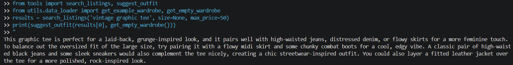

# FitFindr

## What's Included

```
ai201-project2-fitfindr/
├── tools.py                   # The three tools (search_listings, suggest_outfit, create_fit_card)
├── agent.py                   # Planning loop (run_agent) — LLM tool-calling orchestration
├── app.py                     # Gradio web interface
├── data/
│   ├── listings.json          # 40 mock secondhand listings
│   └── wardrobe_schema.json   # Wardrobe format + example wardrobe
├── utils/
│   └── data_loader.py         # Helper functions for loading the data
├── tests/
│   └── test_tools.py          # Pytest tests — one per tool failure mode
├── conftest.py                # Puts the project root on sys.path for tests
├── planning.md                # Plan
└── requirements.txt           # Python dependencies
```

## Setup

```bash
pip install -r requirements.txt
```

Set your Groq API key in a `.env` file (get a free key at [console.groq.com](https://console.groq.com)):

```
GROQ_API_KEY=your_key_here
```

## The Mock Listings Dataset

`data/listings.json` contains 40 mock secondhand listings across categories (tops, bottoms, outerwear, shoes, accessories) and styles (vintage, y2k, grunge, cottagecore, streetwear, and more).

Each listing has: `id`, `title`, `description`, `category`, `style_tags`, `size`, `condition`, `price`, `colors`, `brand`, and `platform`.

Load it with:

```python
from utils.data_loader import load_listings
listings = load_listings()
```

## The Wardrobe Schema

`data/wardrobe_schema.json` defines the format your agent uses to represent a user's existing wardrobe. It includes:

- `schema`: field definitions for a wardrobe item
- `example_wardrobe`: a sample wardrobe with 10 items you can use for testing
- `empty_wardrobe`: a starting template for a new user

Load an example wardrobe with:

```python
from utils.data_loader import get_example_wardrobe
wardrobe = get_example_wardrobe()
```

## Running It

Run the web app (then open the localhost URL it prints, usually http://localhost:7860):

```bash
python app.py
```

Run the agent from the command line (a happy-path and a no-results example):

```bash
python agent.py
```

Run the tests:

```bash
python -m pytest tests/ -v
```

## Tool Inventory

All signatures below match the actual functions in `tools.py`.

### `search_listings(description, size=None, max_price=None) -> list[dict]`

|             |                                                                                                                                                                                                                                                                                                     |
| ----------- | --------------------------------------------------------------------------------------------------------------------------------------------------------------------------------------------------------------------------------------------------------------------------------------------------- |
| **Inputs**  | `description` (str) — keywords for the item, e.g. `"vintage graphic tee"`<br>`size` (str \| None) — size to filter by; case-insensitive substring match (`"M"` matches `"S/M"`). `None` skips size filtering<br>`max_price` (float \| None) — inclusive price ceiling. `None` skips price filtering |
| **Output**  | `list[dict]` — up to the **top 3** matching listing dicts, sorted by relevance (best first). Returns `[]` when nothing matches — never raises. Each dict has: `id, title, description, category, style_tags, size, condition, price, colors, brand, platform`                                       |
| **Purpose** | Keyword search over the 40 mock listings. Applies the price and size filters first, then scores remaining listings by weighted keyword overlap (title/style tags weighted highest), drops zero-score items, and returns the best matches.                                                           |

### `suggest_outfit(new_item, wardrobe) -> str`

|             |                                                                                                                                                                     |
| ----------- | ------------------------------------------------------------------------------------------------------------------------------------------------------------------- |
| **Inputs**  | `new_item` (dict) — a listing dict (the item being considered)<br>`wardrobe` (dict) — a wardrobe dict with an `"items"` list of wardrobe pieces; may be empty       |
| **Output**  | `str` — a non-empty string with 1–2 outfit suggestions. With a stocked wardrobe it names specific pieces; with an empty wardrobe it returns general styling advice. |
| **Purpose** | Uses the Groq LLM to style the found item against the user's wardrobe. Falls back to a non-LLM suggestion if the API is unavailable.                                |

### `create_fit_card(outfit, new_item) -> str`

|             |                                                                                                                                                                                   |
| ----------- | --------------------------------------------------------------------------------------------------------------------------------------------------------------------------------- |
| **Inputs**  | `outfit` (str) — the outfit suggestion text from `suggest_outfit()`<br>`new_item` (dict) — the listing dict for the item                                                          |
| **Output**  | `str` — a short (2–4 sentence) shareable social-media caption mentioning the item name, price, and platform. If `outfit` is empty/missing, returns a descriptive message instead. |
| **Purpose** | Uses the Groq LLM (higher temperature, so output varies per input) to write an authentic OOTD-style caption for the find.                                                         |

## How the Planning Loop Works

`run_agent(query, wardrobe)` in `agent.py` uses an **LLM tool-calling loop** (Groq's
function-calling API, model `llama-3.3-70b-versatile`). It does **not** run the three
tools in a fixed order — the LLM chooses the next tool based on what previous tools
returned. The conditional logic:

1. Build `messages = [system prompt, user query]`. The system prompt describes the
   three tools and the rules below. The tools are passed as function schemas with
   `tool_choice="auto"`.
2. Each turn, call the LLM:
   - **If the response has no tool calls**, the LLM is done — store its text in
     `session["final_message"]` and stop.
   - **Otherwise**, for each requested tool call, `_dispatch()` runs the real Python
     function, writes the result into `session`, and feeds a compact summary back.
3. Branch points that make it conditional (not a fixed chain):
   - **No results:** if `search_listings` returns `[]`, `_dispatch` sets
     `session["error"]` and returns a `no_results` message; the loop exits early and
     the downstream tools are **never called**.
   - **Out-of-order calls:** if `suggest_outfit` is called before a successful search
     (no `selected_item`), or `create_fit_card` before an outfit exists, the dispatch
     guard returns an error message telling the LLM what to do first, and it
     self-corrects on the next turn.
   - **Runaway protection:** the loop is capped at `_MAX_ITERS` turns, and the whole
     loop is wrapped in `try/except` so a missing API key or mid-loop API error
     becomes a clean `session["error"]` instead of a crash.
4. Termination: the loop ends when the LLM returns a turn with no tool calls, when a
   terminal error is set, or when `_MAX_ITERS` is hit.

## State Management

Two coordinated memories carry information through a single interaction:

- **`messages`** — the LLM's conversational memory (system prompt, user query, the
  LLM's tool-call requests, and compact tool results). This is what lets the LLM
  reason about what has already happened.
- **`session`** — the structured **source of truth**, created by `_new_session()`.
  Every tool result is stored here.

**What is stored and when** (each field written by the step shown):

| Field               | Written when              | Contents                                                   |
| ------------------- | ------------------------- | ---------------------------------------------------------- |
| `query`             | session init              | the original user query                                    |
| `wardrobe`          | session init              | the selected wardrobe dict                                 |
| `parsed`            | `search_listings` call    | the `description` / `size` / `max_price` the LLM extracted |
| `search_results`    | after `search_listings`   | list of matching listing dicts                             |
| `selected_item`     | after a successful search | the top result (`results[0]`)                              |
| `outfit_suggestion` | after `suggest_outfit`    | the suggestion string                                      |
| `fit_card`          | after `create_fit_card`   | the caption string                                         |
| `final_message`     | loop end                  | the LLM's natural-language wrap-up                         |
| `error`             | any tool / loop           | set if the interaction ended early                         |

**How it's passed between tools — state injection.** The LLM only chooses _which_
tool to call and supplies lightweight args (search keywords/size/price). It does
**not** re-serialize the item or outfit dicts. Instead `_dispatch()` injects the real
objects straight from `session`: `suggest_outfit` receives `session["selected_item"]`
and `session["wardrobe"]`, and `create_fit_card` receives `session["outfit_suggestion"]`
and `session["selected_item"]`. So the item found by the search flows into styling and
captioning automatically, and the user never re-enters anything. Tool results returned
into `messages` are kept compact (titles + ids + prices); the full dicts live only in
`session`.

## Error Handling Strategy

Every tool handles its own failure mode without crashing or returning silently empty
output, and the planning loop adds guards on top. Each row includes a concrete example
verified by `tests/test_tools.py`.

| Tool              | Failure mode                                 | Strategy                                                                                                                                                                                                                                                  | Verified example                                                                                                                                                                                                                         |
| ----------------- | -------------------------------------------- | --------------------------------------------------------------------------------------------------------------------------------------------------------------------------------------------------------------------------------------------------------- | ---------------------------------------------------------------------------------------------------------------------------------------------------------------------------------------------------------------------------------------- |
| `search_listings` | No matching listings                         | Returns `[]` (never raises). The agent detects this, sets `session["error"]`, and **stops** — it does not call `suggest_outfit`/`create_fit_card`.                                                                                                        | `test_search_empty_results`: `search_listings("designer ballgown", size="XXS", max_price=5)` returns `[]`. Running `python agent.py` on that query ends with the "no listings matched — try broadening" message and no downstream calls. |
| `suggest_outfit`  | Empty wardrobe, or LLM/API unavailable       | Empty wardrobe → returns general styling advice instead of failing. If the Groq call raises, it returns a non-LLM fallback suggestion. The loop also guards against being called before a successful search.                                              | `test_suggest_outfit_empty_wardrobe` returns a non-empty string for an empty wardrobe; `test_suggest_outfit_fallback_without_api` removes `GROQ_API_KEY` and still gets a non-empty result with no exception.                            |
| `create_fit_card` | Missing/empty outfit, or LLM/API unavailable | Empty/whitespace/`None` outfit → returns a descriptive message **without** calling the LLM. If the Groq call raises, returns a basic fallback caption (still naming item, price, platform). The loop guards against being called before an outfit exists. | `test_create_fit_card_empty_outfit_guard` returns a message for `""`, `"   "`, and `None`; `test_create_fit_card_fallback_without_api` returns a non-empty caption with the API key removed.                                             |

Examples:

1. python -c "from tools import search_listings; print(search_listings('designer ballgown', size='XXS', max_price=5))"
   - Returns an empty list
2. 

3. python -c "
   from tools import search_listings, create_fit_card
   results = search_listings('vintage graphic tee', size=None, max_price=50)
   print(create_fit_card('', results[0]))
   " - Returns: Couldn't generate a fit card — there's no outfit suggestion to caption yet. Try getting a styling suggestion for the item first.

## Spec Reflection

- The spec helped me understand what functions I needed to implement in what order and to outline the pipeline of data to and from the agent and functions.
- The implementation diverged from the spec originally by changing some of the ways the errors are handled. Initially I planned to not return a caption if there wasn't a complete outfit in create_fit_card(), instead I made the caption focus on the new article of clothing if there wasn't a complete outfit.

## AI Usage

- Tool implementation, with an override on search_listings return shape. I directed the AI to implement all three tools in tools.py: keyword-overlap scoring with size/price filters for search, and Groq-backed prompts for the two LLM tools. What I revised: the AI orignally implement a return of a dictionary of the top 3 results with a new relevance field." I overrode that during implementation — the function returns a list[dict] of the original listing dicts and uses the relevance score only for sorting (then discards it), because the downstream code expects results[0] to be a plain listing.
- I directed the AI to write tests in test_tools.py and AI created an implementation using via monkeypatch, so the suite would be deterministic and run with no network/API key — This approach was then overridden and instead demonstrate the real fallback path by popping GROQ_API_KEY from the environment, letting the "normal" cases hit the live Groq API. Now the tests validate the real integration and the no-key fallback, at the cost of needing network for the happy-path cases.
